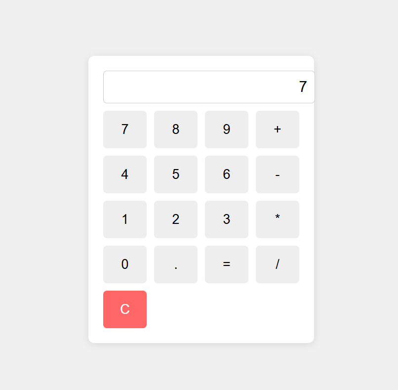

# 🖱️ My Own Cursor App

My Own Cursor App is an AI-powered development assistant where you can simply **type what you want to build**, and it will automatically **generate folders, files, and the required code** for your project.  
It acts like a smart cursor that not only writes but also organizes your project structure seamlessly.  

---

## 📸 Demo

### ✅ Application Output

### 📝 Code Logs

---

## ⚙️ Tech Stack

- **Node.js** – Core runtime for executing the app  
- **Google Generative AI (Gemini API)** – For generating and reasoning about code  
- **File System (fs)** – To write code into files  
- **Child Process (exec)** – To execute system commands (Windows compatible)  

---

## 🛠️ Built By

👨‍💻 [Vedant](https://github.com/VedantShingote11)   

---
